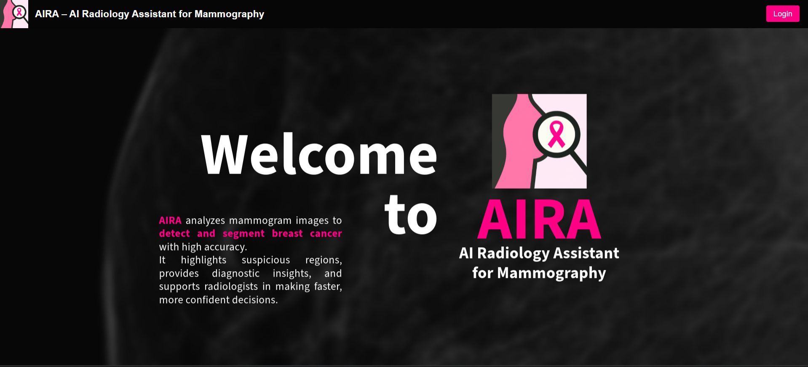
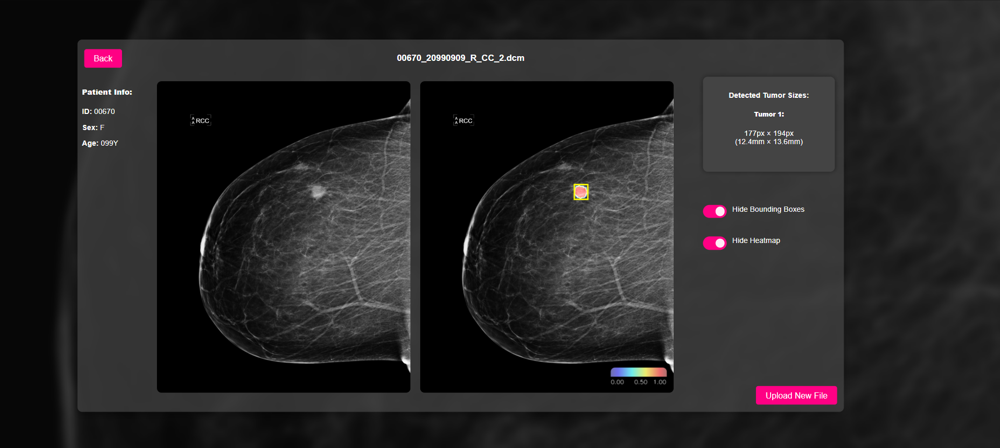
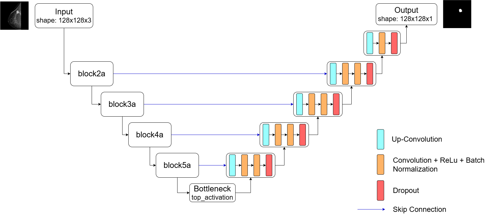

# AIRA - AI Radiology Assistant for Mammography

**AIRA** is an AI-powered assistant developed to support radiologists in the detection and segmentation of breast cancer in mammogram images. It provides tools for identifying suspicious lesions, segmenting tumor regions, and generating diagnostic information such as lesion size and enhanced visualization.



## Key Features

- **Lesion Detection**: Identifies the presence of suspicious lesions in mammographic images.
- **Lesion Segmentation**: Delineates lesion boundaries to support clinical interpretation.
- **Diagnostic Insights**: Measures and reports tumor size based on segmented areas.
- **Multiple Viewing Modes**: Enables improved visualization to assist radiological review.
  


## Model Architecture

AIRA is built using a **U-Net** architecture with an **EfficientNet-B0 encoder**. The encoder was initialized with weights pre-trained on ImageNet, and the model was fine-tuned for the task of breast lesion segmentation.

- **Transfer Learning**: EfficientNet-B0 provides a strong feature extractor that was adapted to the mammography domain.
- **Segmentation Network**: The U-Net decoder enables pixel-wise segmentation suited for medical imaging applications.
  


## Dataset

Training and validation were conducted using the **CSAW-CC** dataset, a mammography dataset containing labeled examples of cancerous lesions. The dataset supports the development of robust models for clinical research.

# Setup Requirements

### Python Packages (backend)
See `server/requirements.txt`. Key packages include:

- Python 3.11.0
- TensorFlow 2.19.0
- Flask 3.1.0
- NumPy, OpenCV, SciPy, Matplotlib, Pillow

### Node.js (frontend)
- Node.js and npm installed  

---

# Setup Instructions

### 1. Clone the Repository
```bash
git clone <repository_url>
```
### 2. Backend Setup
```bash
cd server
py -3.11 -m venv venv              # Create virtual environment with Python 3.11
.\venv\Scripts\activate            # Activate the environment
pip install -r requirements.txt   # Install required Python packages
python server.py                  # Start the Flask server
```
### 3. Frontend Setup
```bash
cd client
npm install      # Install dependencies
npm start        # Launch React frontend at http://localhost:3000
```
### 4. Open the application in your browser at http://localhost:3000.

## Disclaimer

AIRA is intended for **research and educational use only**. It is **not certified for clinical diagnosis** and should not replace the judgment of qualified medical professionals.

